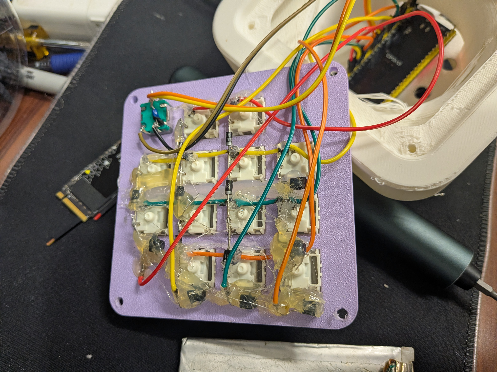

# Codex Micro Macropad Fork

A configurable ESP32-S3 macropad with a 4x4 diode matrix, rotary encoder, USB HID output, RGB lighting, layers, macros, and a VIA-inspired Windows configurator.

This fork is based on the original [codex-micro-device](https://github.com/Nishkalkashyap/codex-micro-device) project. The source here has been adapted for the current rewired hardware and a live configuration workflow.

## Pad Photos


## Build Photos





## What Changed From Upstream

- Replaced the original one-GPIO-per-switch wiring with a 4x4 diode matrix.
- Added matrix calibration mode that reports raw row/column coordinates.
- Updated the physical mapping for the installed pad:
  - Task 1: `R0 C1`
  - Task 2: `R0 C2`
  - Task 3: `R1 C0`
  - Task 4: `R1 C1`
  - Task 5: `R1 C2`
  - Task 6: `R1 C3`
  - Fast: `R2 C0`
  - Approve: `R2 C1`
  - Reject: `R2 C2`
  - Continue: `R2 C3`
  - Mic B: `R3 C1`
  - Mic A: `R3 C2`
  - Send: `R3 C3`
- Moved the encoder push switch to GPIO 12.
- Added live remapping over USB serial with persistent ESP32 flash storage.
- Added two real keymap layers with a momentary `Fn` layer switch.
- Added media controls and eight user macro slots.
- Added text macros and five-key combo macros.
- Added built-in Quick Link actions that do not consume user macro slots.
- Added a live key tester and matrix calibration tool.
- Added correct raw USB HID scan codes for Tab, Enter, function keys, and modifiers.
- Added reliable combined Windows modifier timing and serial reconnect handling.
- Added a portable Windows Electron configurator with the supplied application icon.

## Hardware Pinout

### Matrix

The current firmware uses low-side row scanning and internal column pull-ups.

| Matrix line | GPIO | Firmware mode |
| --- | ---: | --- |
| Row 0 | 8 | Output, scanned low |
| Row 1 | 9 | Output, scanned low |
| Row 2 | 10 | Output, scanned low |
| Row 3 | 11 | Output, scanned low |
| Column 0 | 4 | Input pull-up |
| Column 1 | 5 | Input pull-up |
| Column 2 | 6 | Input pull-up |
| Column 3 | 7 | Input pull-up |

Use one diode per switch. For the current scan direction:

```text
column bus ----|>|---- switch ---- row bus
               diode
```

The diode stripe/cathode faces the row bus. Do not connect matrix switches directly to ground.

The complete physical diagram is in [MATRIX-WIRING.md](MATRIX-WIRING.md).

### Encoder and RGB

| Function | GPIO |
| --- | ---: |
| Encoder A / CLK | 17 |
| Encoder B / DT | 18 |
| Encoder push switch | 12 |
| Encoder and push-switch ground | GND |
| RGB data | 47 |

GPIO 19 and 20 remain unused for the ESP32-S3 native USB interface.

## Firmware

The firmware is a PlatformIO project in [firmware/](firmware/). Build it with:

```powershell
$pio = "$env:USERPROFILE\.platformio\penv\Scripts\pio.exe"
& $pio run -d firmware -e codex-micro
```

For the CH343 programming adapter used by this build:

```powershell
& $pio run -d firmware -e codex-micro -t upload --upload-port COM10
```

Change `COM10` to the port shown by Windows.

The firmware defaults all controls to `None`. Configure mappings in the editor and save them to the ESP32.

## Configurator

The source is in [macro-editor/](macro-editor/). It supports Windows Chrome/Edge Web Serial and a portable Electron build.

Install and run the desktop version:

```powershell
cd macro-editor
npm install
npm start
```

Build the portable executable:

```powershell
npm run dist
```

The output is written to `macro-editor/dist/` when the standard build directory is available. The repository also contains generated release folders from local builds; generated output is excluded from Git.

### Configurator features

- Click a physical control, then choose a key from the palette.
- **Keymap 0** and **Keymap 1** are independent layers.
- Assign `Fn` on Keymap 0, then hold it to activate Keymap 1.
- **Key tester** reports physical key, encoder press, and encoder rotation events.
- **Matrix calibration** records raw `R# C#` coordinates in press order.
- **MACRO** supports eight user-defined slots.
- Macro editing supports text strings and key combos of up to five keys.
- **QUICKLINK** provides built-in `Win+X` sequences without using user macro slots.
- **MEDIA** provides consumer-control actions.
- Save waits for an ESP32 confirmation and reloads both layers afterward.
- Unplugging and reconnecting the device does not require restarting the editor.

## Quick Link Actions

The dedicated QUICKLINK palette includes:

- Terminal: `Win+X`, then `I`
- Administrator Terminal: `Win+X`, then `A`
- Task Manager: `Win+X`, then `T`
- Disk Management: `Win+X`, then `K`
- Device Manager: `Win+X`, then `M`
- Computer Management: `Win+X`, then `G`
- File Explorer: `Win+X`, then `E`
- Run: `Win+X`, then `R`

These actions are implemented as firmware keycodes `232` through `239`, separate from user macro slots.

## Troubleshooting

### A switch does not appear in calibration

Use the calibration tool before changing the logical map. A missing entire row or column indicates an open bus, solder joint, diode, or wire. The current GPIO mapping is listed above.

### The encoder push button works but rotation does not

The encoder rotary common must connect to GND. The two rotary contacts must connect to GPIO 17 and GPIO 18. The push switch is separate and connects to GPIO 12 and GND. Use continuity mode to verify that both rotary contacts alternate with the common while turning.

### Key combinations produce the wrong key

Use the current portable configurator build and reconnect the device. The firmware emits raw USB HID usages and expands Ctrl, Shift, Alt, and Win modifier bitmasks individually.

## Project Files

- [firmware/main.cpp](firmware/main.cpp): ESP32-S3 matrix scanner, HID, layers, macros, media, RGB, and serial protocol.
- [firmware/platformio.ini](firmware/platformio.ini): PlatformIO environment.
- [macro-editor/index.html](macro-editor/index.html): Configurator layout.
- [macro-editor/app.js](macro-editor/app.js): Web Serial protocol and editor behavior.
- [macro-editor/desktop/main.cjs](macro-editor/desktop/main.cjs): Portable Electron host.
- [MATRIX-WIRING.md](MATRIX-WIRING.md): Matrix and encoder wiring diagram.
