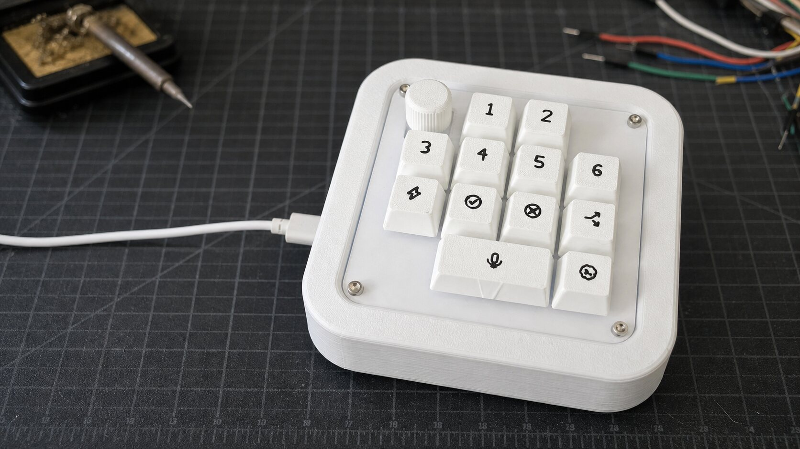
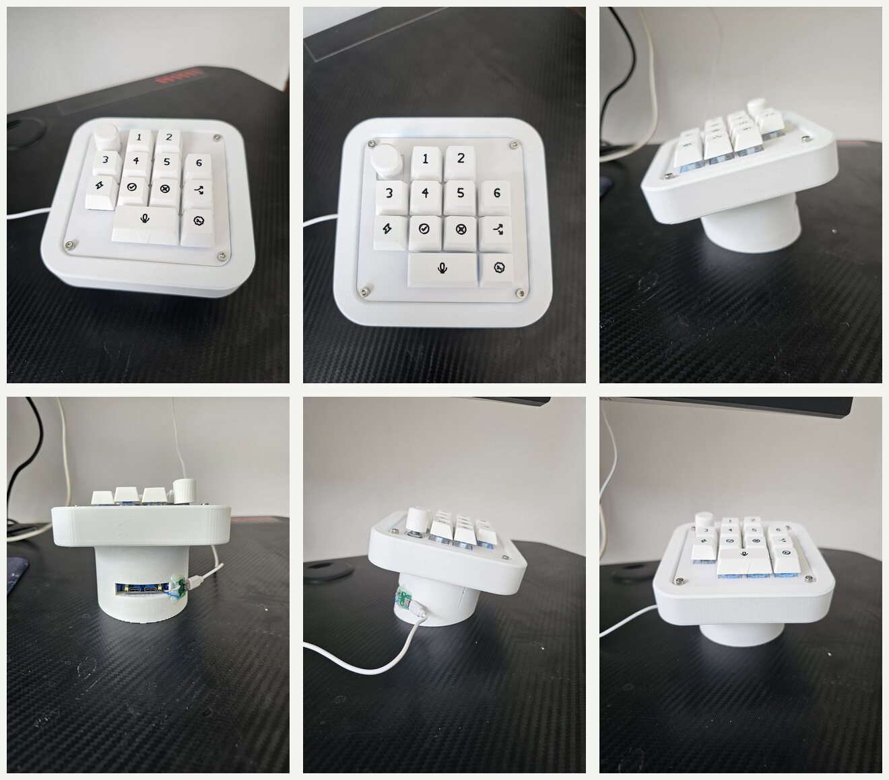
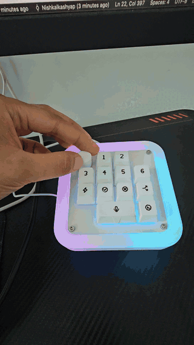
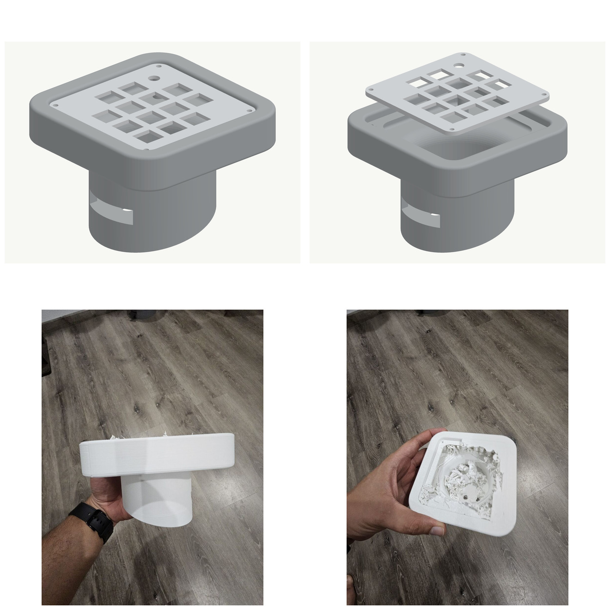
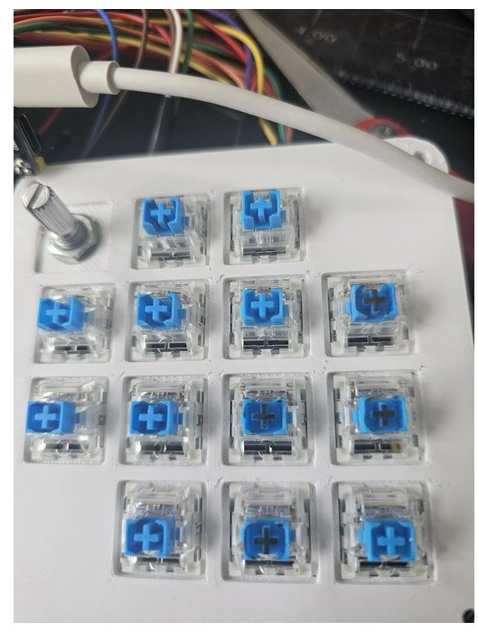
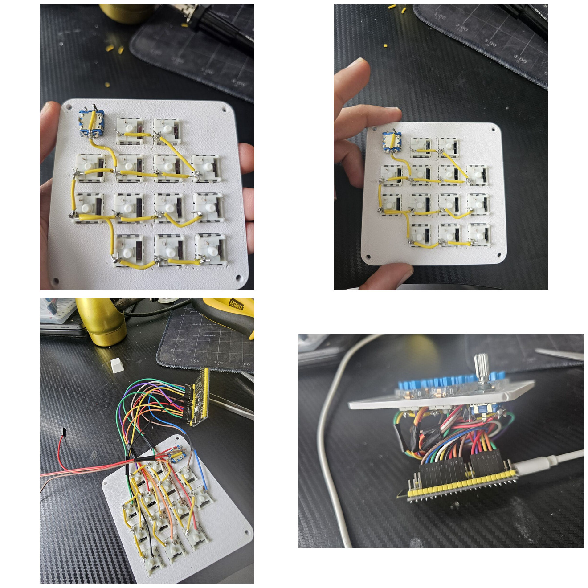
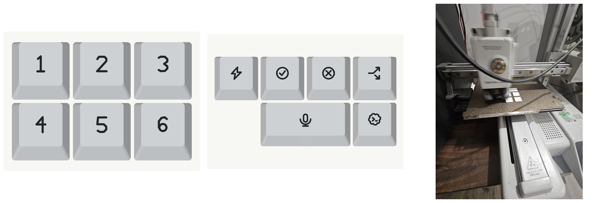
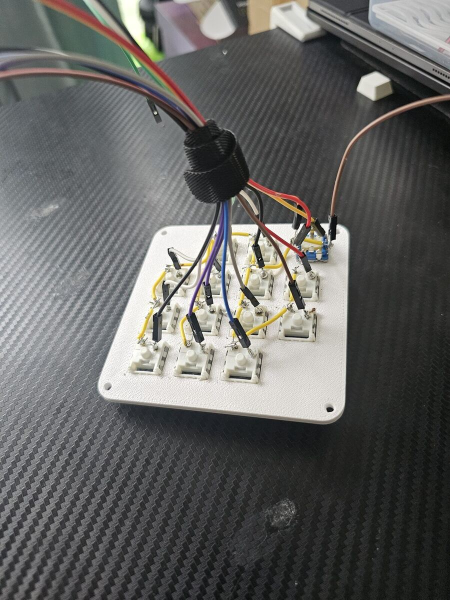
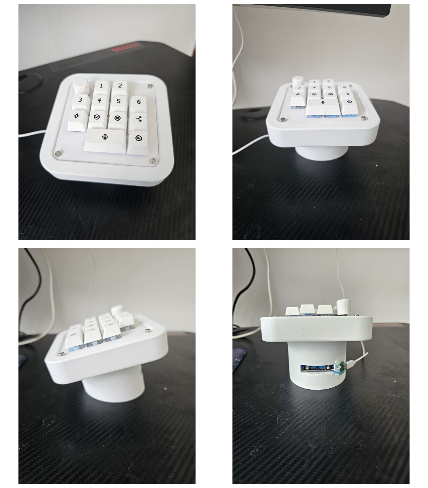

# DIY Codex Micro

So Codex launched "Codex Micro" last week, on July 15th, 2026. It received a lot of criticism and memes - some of it fair, some of it just funny. When I saw the [launch video](https://www.youtube.com/watch?v=m8uUUUsMD3Y), a thought occurred to me - "Wait, even I can make this in a weekend lol!" So here we are - after a weekend of hacking with Codex and reviving my lost passion for embedded electronics, we've got a working prototype! To be fair, it's something of a prototype resembling the original product.

Spoiler alert! It's as useless as it seems. But it was a good weekend project, and if you still want to waste away a weekend of your life, here's how it came together -

## What it actually is (and isn't)

It's an unofficial USB shortcut controller, not a clone. It shows up as a plain keyboard, so it's remappable for anything - the shortcuts here target Codex on Windows by default.

The original Codex Micro also has a feedback mechanism: LEDs on the device that tell you the status of your agents and more. But that part seems proprietary, and I couldn't find any documentation on it, so I left it out.

That doesn't mean we don't have RGB, though! We sure do. A hacker's device is incomplete without RGB - everyone knows that.

## How does it work?

At the heart of it is an ESP32-S3, which acts as a native USB controller. That's the whole trick: because the S3 speaks native USB, it can *pretend* to be a keyboard when you plug it in - no drivers, no companion app. We program it to emit specific keycodes and shortcuts when you press the buttons, and then we register those same shortcuts in the Codex app's keybindings to mimic the behaviour.

The RGB around the device is totally optional (and honestly overkill). It's just there to show feedback on which button you pressed. But I added it because RGB is cool, and it doesn't make for a fancy showcase without it. :)

So all in all, it's a fancy keyboard.

## Building it

Here are the steps:

**1. Design and print the enclosure.** I designed the body and switch plate in Fusion 360 - a square top on a round pedestal, so all the wiring has somewhere to hide. Print the plate first as a fit test, then the body.

**2. Flash the firmware** onto the ESP32-S3 (PlatformIO project is in the [firmware/](firmware/) folder). Flash over the COM/programming port, then move the cable to the native USB port.

**3. Install the switches and the rotary encoder** into the plate. Thirteen MX switches in a 4×4 grid (two slots stay empty), plus one EC11 encoder in the corner.

**4. Wire it up.** One terminal of every switch joins a shared ground bus; the other terminal runs to its own GPIO. No matrix, no diodes - one pin per key.

**5. Bind the shortcuts** inside the Codex app's keybindings, matching the keycodes the firmware emits (full keycode map is in the GPIO & shortcut map section below).

**6. Add the keycaps, then close the case.** The caps are two-colour prints - six numbered task caps, action icons, and a wide 2U microphone cap.

## The debugging trick that saved me

Admittedly, I have poor soldering skills, and even poorer C++/embedded coding skills.

Codex was there to help me with all the coding. And TBH, it's fully vibe coded - I barely read the code or the error messages. I described the behaviour I wanted, asked Codex to fix whatever didn't match, and it worked.

> Sidenote: vibe coding is such a blessing for makers. Side projects I would never have started, I'm now able to build, because the mental barrier is gone.

Back to the bugs. Between my poor soldering and my refusal to read the code, the first few iterations misbehaved in fun ways. I'd press a key expecting one thing, and get something else entirely - or press a key and watch it emit a string of keycodes I never asked for.

Here's the one that stuck with me: I had assumed the physical key layout would follow the GPIO order I'd wired. It did not. So instead of tracing thirteen wires by hand, I asked Codex to reflash the firmware so the keys just emitted `q w e r t y u i o p a s d`, one letter per key. Then I pressed them in physical order - top-left to bottom-right - and read the jumbled output straight off the screen. That told me the *real* installed order in about thirty seconds, and from there fixing the mapping (and the weird click behaviour) was easy.

That's the lesson that reinforced itself for me: **vibe coding isn't as bad as people say, as long as you bring a structured debugging approach.** It's like being a manager. You're working with someone who's too deep in the weeds to see the issue, but you have the zoomed-out view. Your job is to build a constrained, simple workflow that forces the bug to surface. Pair programming with Codex feels exactly like that - I'm the manager, Codex is the engineer, and I can guide it to find and fix bugs *if* I can structure the problem well. It can't crawl out of my laptop and poke the hardware for me, so that structure is the whole job.

## What I deliberately didn't do

I could have made it "more professional" and truer to the original product, but then it wouldn't have been a weekend project.

So for anyone expecting a clone: this isn't it. But hopefully this repo works as a starter to help you build your own version. I'd love to see what you come up with - if you make something, please share it with me!

## Was it really a weekend?

Honestly, it was close. My in-laws were visiting, so technically not a clean weekend - but a little time over the weekend plus a little on Monday got it done. The final touches early Tuesday were just 3D-printing better-looking keycaps.

## What's next?

This started as one question - could something resembling Codex Micro actually be built over a weekend? Now I have my answer, and I probably won't take it any further; it was never meant to be a real product. But it scratched an itch I'd ignored for years and pulled me back into embedded electronics - which might be the best thing to come out of an otherwise useless keyboard.

## Glossary and BOM

### Glossary

- **ESP32-S3** - the microcontroller at the core. Crucially, it has *native USB*, so it can act as a real USB device. (An ESP32-**C3** looks similar but can't do this properly - don't substitute it.)
- **USB HID** - the "keyboard/mouse" USB protocol. Emitting HID reports is how the device types shortcuts into your computer with no drivers.
- **GPIO** - a general-purpose pin on the ESP32. Here, one pin reads one switch.
- **EC11 encoder** - the rotary knob with a push-click, used to scrub reasoning level.
- **WS2812** - the addressable RGB pixels used for the border lighting.
- **No key matrix** - with only 13 keys, each switch gets its own GPIO instead of a scanned row/column grid. Simpler to wire and to debug.

### Bill of materials

**Core controller**

| Qty | Part | Notes |
| ---: | --- | --- |
| 1 | ESP32-S3 dev board with native USB | I used an [OceanLabz N16R8 dual-USB board](https://www.amazon.in/dp/B0F9XB91XG). **Not an ESP32-C3.** |
| 13 | [MX-compatible mechanical switches](https://www.amazon.in/dp/B0G11FQ3ZN) | One GPIO per switch; no matrix or diodes. I used SonaBhu blue switches. |
| 12 | Keycaps (11 × 1U + 1 × 2U) | The 2U microphone cap spans two switches. |
| 1 | [EC11 rotary encoder with push switch + knob](https://www.amazon.in/dp/B07THRXT4F) | |
| 1 set | 3D-printed body + switch plate | Files below. |
| 4 sets | M3 × 25 mm bolts and nuts | |
| - | [26–28 AWG jumper wire](https://www.amazon.in/dp/B074JB6SX8), solder | For the ground bus and signal wires. |
| 1 | Data-capable USB-C cable | A charge-only cable will waste hours of your life. |

**Optional RGB lighting**

| Qty | Part | Notes |
| ---: | --- | --- |
| 23 | WS2812 pixels | Firmware is set for 23 pixels on GPIO 47. |
| 1 | Regulated 5 V supply, ≥1.5 A | Don't power a full strip from the ESP32 board. |
| 1 | 74AHCT125 level shifter | Converts the 3.3 V data signal to a clean 5 V. |
| 1 each | 330 Ω resistor, 500–1000 µF capacitor, 0.1 µF capacitor | Data-line and power protection. |

Rough cost in India (July 2026): **₹2,500–₹5,500**, excluding the printer, tools, and premium switches/filament.

### GPIO & shortcut map

| Physical control | GPIO | Emits | Codex action |
| --- | ---: | --- | --- |
| Task 1–6 | 6, 10, 4, 7, 11, 14 | `Control+1` … `Control+6` | Select task 1–6 |
| Fast | 5 | `Shift+F20` | Fast mode |
| Approve | 8 | `Control+F19` (700 ms hold) | Approve |
| Reject | 12 | `Control+F20` | Reject |
| Continue | 15 | `Shift+F19` | Continue in a new task |
| Push-to-talk | 9 and 13 | Hold `Control+F13` | Push-to-talk |
| Send | 16 | `F20` | Send message |
| Encoder CW | 17 | `F17` | Increase reasoning |
| Encoder CCW | 18 | `F18` | Decrease reasoning |
| Encoder press | 21 | `F16` | Cycle reasoning / plan |
| Encoder long press | 21 | `F13` | Toggle sidebar |
| RGB data | 47 | - | 23-pixel lighting |

> Keep GPIO 19 and 20 unused - the ESP32-S3's native USB peripheral needs them.

### Downloads

| Asset | Link |
| --- | --- |
| Printable body + plate (3MF) | [codex-micro-structure.3mf](assets/codex-micro-structure.3mf) |
| Editable Fusion 360 source (F3D) | [codex-micro-structure.f3d](assets/codex-micro-structure.f3d) |
| Two-colour keycaps (3MF) | [keycaps.3mf](assets/keycaps.3mf) |
| Firmware (PlatformIO) | [firmware/](firmware/) |
